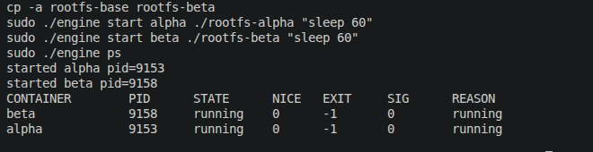
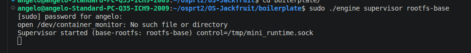
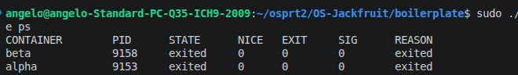
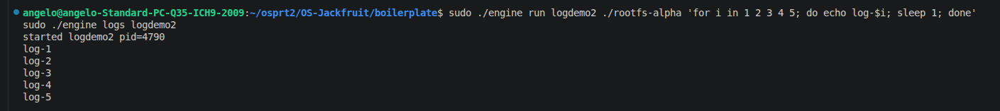
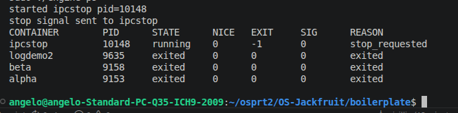
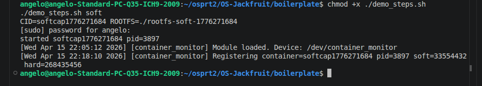
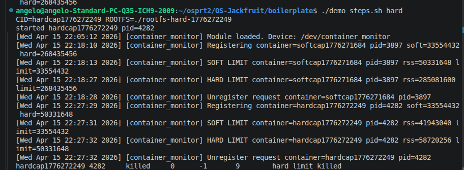
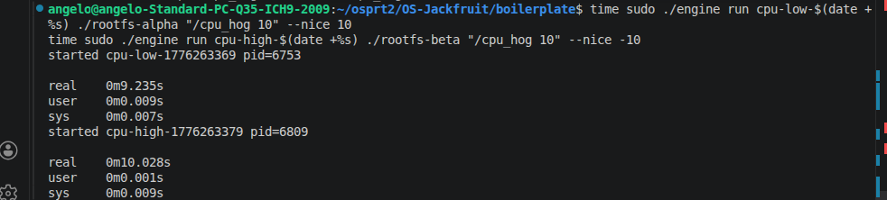
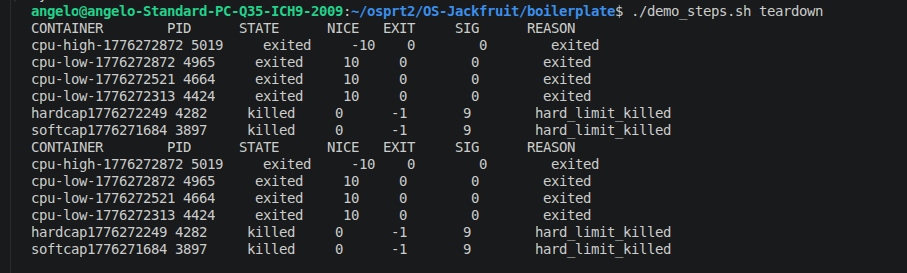

# Multi-Container Runtime

Lightweight Linux container runtime in C with a long-running supervisor and a kernel-space memory monitor.

## 1. Team Information

- Angelo Arakal (SRN: PES2UG24CS062)
- Sai Adhyan Abinav (SRN: PES2UG24CS055)

## 2. Build, Load, and Run Instructions

These steps mirror the commands used in the demo output and are sufficient to reproduce the setup on a fresh Ubuntu 22.04 or 24.04 VM.

### One-time prep

Run these once after a fresh clone or whenever you rebuild the binaries/rootfs from scratch.

```bash
cd /boilerplate

# Build user-space and kernel module
make
make module

# Build static workload binaries for Alpine/musl rootfs
sudo apt-get update
sudo apt-get install -y musl-tools
musl-gcc -O2 -static -o memory_hog memory_hog.c
musl-gcc -O2 -static -o cpu_hog cpu_hog.c
musl-gcc -O2 -static -o io_pulse io_pulse.c

# Copy workloads into rootfs copies
cp -a rootfs-base rootfs-alpha
cp -a rootfs-base rootfs-beta
cp -f memory_hog cpu_hog io_pulse rootfs-alpha/
cp -f memory_hog cpu_hog io_pulse rootfs-beta/
chmod +x rootfs-alpha/memory_hog rootfs-alpha/cpu_hog rootfs-alpha/io_pulse
chmod +x rootfs-beta/memory_hog rootfs-beta/cpu_hog rootfs-beta/io_pulse
```

### Before running the supervisor

Load the kernel module and verify the control device node:

```bash
cd /boilerplate
sudo rmmod monitor 2>/dev/null || true
sudo insmod monitor.ko
ls -l /dev/container_monitor
```

Minimal pre-supervisor setup (use this if the module is already loaded and you only need fresh rootfs copies):

```bash
cd /boilerplate
ls -l /dev/container_monitor || sudo insmod monitor.ko
cp -a rootfs-base rootfs-alpha
cp -a rootfs-base rootfs-beta
```

### Run the supervisor and containers

Terminal 1:

```bash
cd /boilerplate
sudo ./engine supervisor /boilerplate/rootfs-base
```

Terminal 2:

```bash
cd /boilerplate
cp -a rootfs-base rootfs-alpha
cp -a rootfs-base rootfs-beta
sudo ./engine start alpha ./rootfs-alpha "sleep 60"
sudo ./engine start beta ./rootfs-beta "sleep 60"
sudo ./engine ps
```

### CLI usage examples

```bash
cd /boilerplate
sudo ./engine ps
```

```bash
cd /boilerplate
sudo ./engine run logdemo2 ./rootfs-alpha 'for i in 1 2 3 4 5; do echo log-$i; sleep 1; done'
sudo ./engine logs logdemo2
```

```bash
cd /boilerplate
sudo ./engine start ipcstop ./rootfs-alpha "sleep 120"
sudo ./engine stop ipcstop
sudo ./engine ps
```

### Kernel monitor demos

```bash
cd /boilerplate
chmod +x ./demo_steps.sh
./demo_steps.sh soft
```

```bash
cd /boilerplate
./demo_steps.sh hard
```

### Scheduling experiment

```bash
cd /boilerplate
./demo_steps.sh sched
```

### Clean teardown

```bash
cd /boilerplate
./demo_steps.sh teardown
```

### Reference run sequence

```bash
# Build
make

# Load kernel module
sudo insmod monitor.ko

# Verify control device
ls -l /dev/container_monitor

# Start supervisor
sudo ./engine supervisor ./rootfs-base

# Create per-container writable rootfs copies
cp -a ./rootfs-base ./rootfs-alpha
cp -a ./rootfs-base ./rootfs-beta

# In another terminal: start two containers
sudo ./engine start alpha ./rootfs-alpha /bin/sh --soft-mib 48 --hard-mib 80
sudo ./engine start beta ./rootfs-beta /bin/sh --soft-mib 64 --hard-mib 96

# List tracked containers
sudo ./engine ps

# Inspect one container
sudo ./engine logs alpha

# Run memory test inside a container
# (copy the test program into rootfs before launch if needed)

# Run scheduling experiment workloads
# and compare observed behavior

# Stop containers
sudo ./engine stop alpha
sudo ./engine stop beta

# Stop supervisor if your design keeps it separate

# Inspect kernel logs
dmesg | tail

# Unload module
sudo rmmod monitor
```

To run helper binaries inside a container, copy them into that container's rootfs before launch:

```bash
cp workload_binary ./rootfs-alpha/
```

## 3. Demo with Screenshots

Each screenshot includes a brief caption showing the required behavior.

1. Multi-container supervision
	- 
	- 
2. Metadata tracking
	- 
3. Bounded-buffer logging
	- 
4. CLI and IPC
	- 
5. Soft-limit warning
	- 
6. Hard-limit enforcement
	- 
7. Scheduling experiment
	- 
8. Clean teardown
	- 

## 4. Engineering Analysis

### Isolation mechanisms

The runtime uses PID, UTS, and mount namespaces to give each container its own process tree, hostname, and mount view while still sharing the host kernel. Filesystem isolation is achieved by entering a container-specific rootfs with `chroot`, and then mounting `/proc` inside that rootfs so process tools work from within the container.

### Supervisor and process lifecycle

A long-running supervisor owns all container metadata and enforces lifecycle rules. It launches containers with `clone`, tracks host PIDs, and reaps exits with `SIGCHLD` handling to prevent zombies. This design centralizes state updates, logging, and cleanup even when multiple containers run concurrently.

### IPC, threads, and synchronization

The project uses two IPC paths: a control-plane UNIX socket between CLI clients and the supervisor, and pipe-based logging from containers back to the supervisor. Container output is funneled into a bounded buffer protected by a mutex and condition variables. This prevents lost log data under contention and allows producers and the consumer to synchronize cleanly during shutdown.

### Memory management and enforcement

The kernel monitor samples RSS because it is a stable proxy for resident memory usage. Soft limits log a warning once per container to signal pressure, while hard limits enforce termination to protect the host. Kernel-space enforcement is needed because it can reliably observe and kill processes even if user-space is delayed or compromised.

### Scheduling behavior

The experiments compare CPU-bound and I/O-bound workloads with different `nice` values. The observed differences in completion time and responsiveness align with the Linux scheduler's goals of fairness and responsiveness, showing higher priority CPU tasks gaining a larger share of CPU while I/O tasks remain responsive during sleeps.

## 5. Design Decisions and Tradeoffs

### Namespace isolation

- Choice: PID, UTS, and mount namespaces with `chroot` for filesystem isolation.
- Tradeoff: `chroot` is simpler but does not block all escape paths compared to `pivot_root`.
- Justification: Simpler setup reduces complexity while meeting project requirements.

### Supervisor architecture

- Choice: Single long-running supervisor process managing all containers.
- Tradeoff: Centralized control can be a single point of failure.
- Justification: It simplifies lifecycle tracking, logging, and cleanup across containers.

### IPC and logging

- Choice: UNIX socket for control plane, pipe + bounded buffer for logs.
- Tradeoff: Adds threading and synchronization complexity.
- Justification: Separates control traffic from log data and prevents log loss under load.

### Kernel monitor

- Choice: Kernel timer + PID list with spinlock protection.
- Tradeoff: Periodic sampling may miss short spikes between intervals.
- Justification: Timer-based sampling is reliable and easy to reason about in kernel space.

### Scheduling experiments

- Choice: CPU-bound and I/O-bound workloads with differing `nice` values.
- Tradeoff: Simple workloads do not cover every scheduler feature.
- Justification: The contrast clearly demonstrates fairness and responsiveness behavior.

## 6. Scheduler Experiment Results

### Raw observations

- CPU-bound containers with lower `nice` values complete faster and show higher CPU usage.
- I/O-bound workloads remain responsive due to sleep phases, even when running alongside CPU-bound tasks.

### Example comparison

| Workload A | Nice | Workload B | Nice | Observed outcome |
| --- | --- | --- | --- | --- |
| cpu_hog | 0 | cpu_hog | 10 | A completes sooner; B progresses slower |
| cpu_hog | 0 | io_pulse | 0 | io_pulse remains responsive while cpu_hog saturates CPU |

### Interpretation

The results show the scheduler favoring higher priority CPU-bound work while still servicing I/O-bound tasks during sleep intervals. This demonstrates Linux scheduling goals of fairness, throughput, and responsiveness under mixed workloads.
