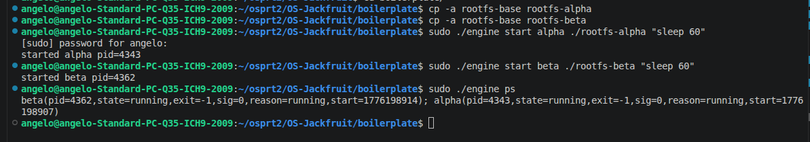
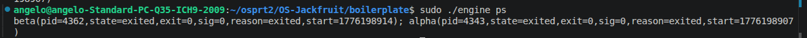
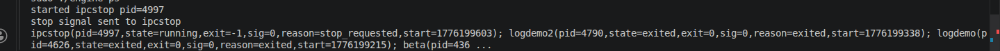
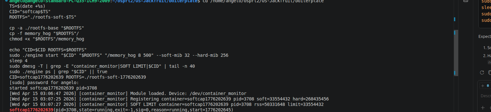
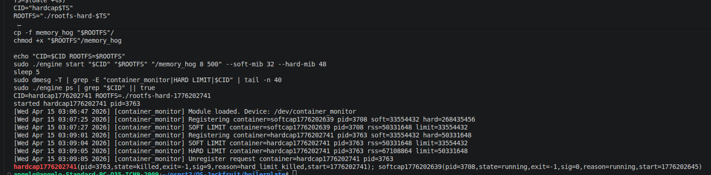

# Screenshot Evidence Template

Use this file to record each required screenshot item.
For every section:
- Run the command(s)
- Paste the real output under Output
- Add your screenshot image link later

## 0. One-time prep 

###  Command
```bash
cd /home/angelo/osprt2/OS-Jackfruit/boilerplate

# Build user-space and kernel module
make
make module

# Load monitor module
sudo rmmod monitor 2>/dev/null || true
sudo insmod monitor.ko
ls -l /dev/container_monitor

# Build static workload binaries for Alpine/musl rootfs
sudo apt-get update
sudo apt-get install -y musl-tools
musl-gcc -O2 -static -o memory_hog memory_hog.c
musl-gcc -O2 -static -o cpu_hog cpu_hog.c
musl-gcc -O2 -static -o io_pulse io_pulse.c

# Copy workloads into rootfs copies
cp -a rootfs-base rootfs-alpha
cp -a rootfs-base rootfs-beta
cp -f memory_hog cpu_hog io_pulse rootfs-alpha/
cp -f memory_hog cpu_hog io_pulse rootfs-beta/
chmod +x rootfs-alpha/memory_hog rootfs-alpha/cpu_hog rootfs-alpha/io_pulse
chmod +x rootfs-beta/memory_hog rootfs-beta/cpu_hog rootfs-beta/io_pulse
```

## 1. Multi-container supervision

###  Command
Terminal 1:
```bash
cd /home/angelo/osprt2/OS-Jackfruit/boilerplate
sudo ./engine supervisor /home/angelo/osprt2/OS-Jackfruit/boilerplate/rootfs-base
```


Terminal 2:
```bash
cd /home/angelo/osprt2/OS-Jackfruit/boilerplate
cp -a rootfs-base rootfs-alpha
cp -a rootfs-base rootfs-beta
sudo ./engine start alpha ./rootfs-alpha "sleep 60"
sudo ./engine start beta ./rootfs-beta "sleep 60"
sudo ./engine ps
```


### Screenshot
terminal 2


terminal 1


---

## 2. Metadata tracking

###  Command
```bash
cd /home/angelo/osprt2/OS-Jackfruit/boilerplate
sudo ./engine ps
```

The `ps` output now prints one container per line in a table, so it is easier to capture in screenshots.


### Screenshot


---

## 3. Bounded-buffer logging

###  Command
```bash
cd /home/angelo/osprt2/OS-Jackfruit/boilerplate
sudo ./engine run logdemo2 ./rootfs-alpha 'for i in 1 2 3 4 5; do echo log-$i; sleep 1; done'
sudo ./engine logs logdemo2
```


### Screenshot
Add screenshot here.

---

## 4. CLI and IPC

###  Command
```bash
cd /home/angelo/osprt2/OS-Jackfruit/boilerplate
sudo ./engine start ipcstop ./rootfs-alpha "sleep 120"
sudo ./engine stop ipcstop
sudo ./engine ps
```


### Screenshot


---

## 5. Soft-limit warning

### Command
```bash
cd /home/angelo/osprt2/OS-Jackfruit/boilerplate
chmod +x ./demo_steps.sh
./demo_steps.sh soft
```

Sections 5-8 use `./demo_steps.sh` so you can rerun each screenshot step with a single command.


### Screenshot

---

## 6. Hard-limit enforcement

### Command
```bash
cd /home/angelo/osprt2/OS-Jackfruit/boilerplate
./demo_steps.sh hard
```


### Screenshot


---

## 7. Scheduling experiment


```bash
cd /home/angelo/osprt2/OS-Jackfruit/boilerplate
./demo_steps.sh sched
```


### Screenshot


---

## 8. Clean teardown

### Copy-paste Command
```bash
cd /home/angelo/osprt2/OS-Jackfruit/boilerplate
./demo_steps.sh teardown
```

### Output
Paste terminal output here.

### Screenshot
Add screenshot here.

